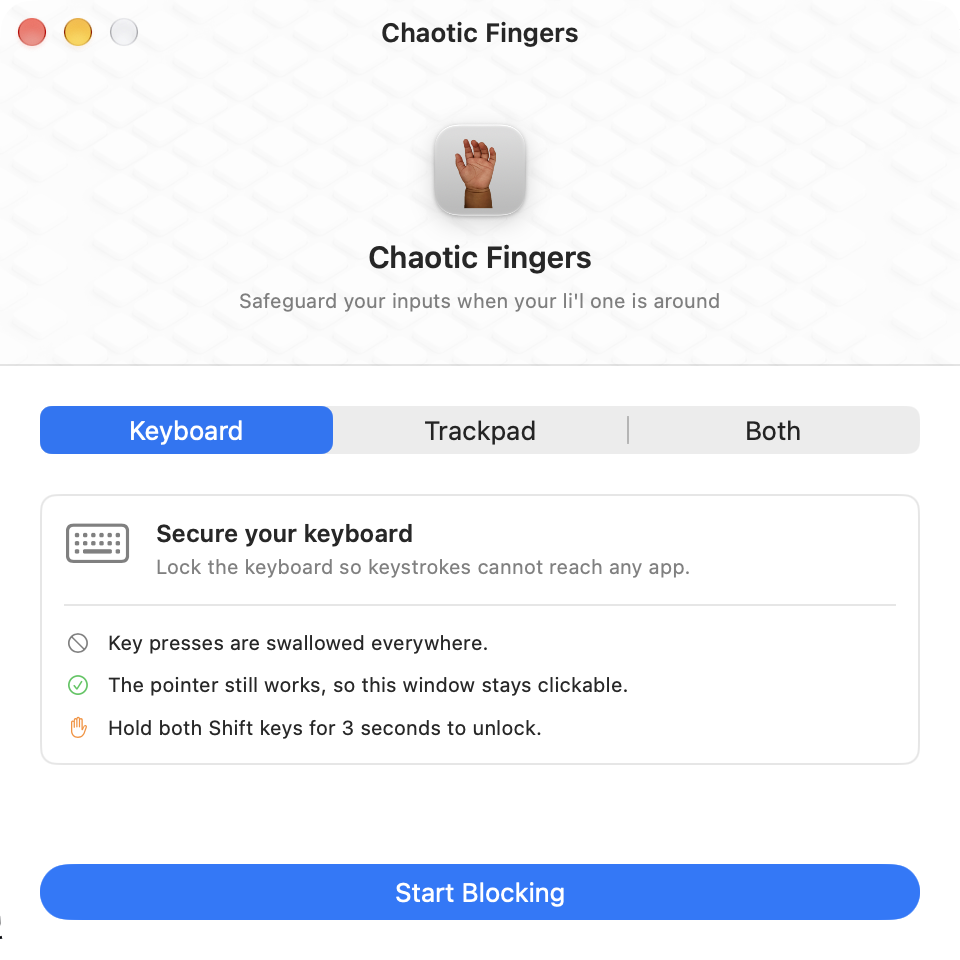
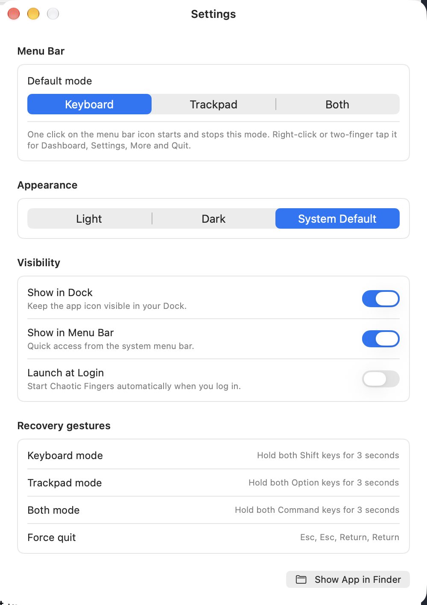

<div align="center">

# Chaotic Fingers

**Lock your Mac's keyboard and trackpad so small hands — or a cleaning cloth — can't cause chaos.**

[](https://www.apple.com/macos/)
[](https://swift.org)
[-blue.svg)](#building-from-source)

</div>

---

Chaotic Fingers suppresses keyboard and pointer input system-wide while leaving its own window
clickable, so you always have a way out. If the window is hidden, a physical modifier-hold gesture
unlocks your Mac — no reboot, no force quit.

Useful when a toddler is on your lap, when you're wiping down the keyboard, or any time you need
the screen on and the inputs off.

<div align="center">
  
  &nbsp;&nbsp;
  
</div>

## Contents

- [Features](#features)
- [Requirements](#requirements)
- [Installation](#installation)
- [Accessibility permission](#accessibility-permission)
- [Usage](#usage)
- [Configuration](#configuration)
- [Building from source](#building-from-source)
- [Tests](#tests)
- [Packaging and code signing](#packaging-and-code-signing)
- [Architecture](#architecture)
- [Troubleshooting](#troubleshooting)
- [Contributing](#contributing)
- [License](#license)

## Features

- **Three lock modes** — keyboard only, trackpad and mouse only, or both at once.
- **Always a way out** — the app's own window stays clickable in every mode, and physical
  modifier-hold gestures work even when every window is hidden.
- **Menu bar control** — one click toggles your default mode; right-click opens a full menu.
  The icon switches between a hollow and a filled hand so the state is readable at a glance.
- **Honest failure** — if macOS refuses the event tap, the app says so instead of claiming to
  block with nothing blocked.
- **Native interface** — windows size to their content, respect Light/Dark and the system accent,
  and honour Reduce Motion, Reduce Transparency and Increase Contrast.
- **Launch at login**, optional Dock icon, optional menu bar item.

Nothing is recorded, stored, or transmitted. Input events are discarded, not inspected.

## Requirements

| | |
|---|---|
| **OS** | macOS 14 Sonoma or later |
| **Hardware** | Apple silicon or Intel (ships universal) |
| **Permission** | Accessibility (required — see below) |
| **To build** | Swift 5.9 toolchain; Xcode optional ([caveats](#building-from-source)) |

## Installation

### From the DMG

The installer is not checked into the repository — build it with `bash package.sh`, which writes
`dist/ChaoticFingers-Installer.dmg`. Then:

1. Open the DMG.
2. Drag **Chaotic Fingers** into **Applications**.
3. Launch it and grant Accessibility access when asked.

If macOS blocks the first launch, right-click the app and choose **Open**, or clear the quarantine
flag:

```bash
xattr -cr "/Applications/Chaotic Fingers.app"
```

### From source

```bash
git clone https://github.com/1mrajeevranjan/Chaotic-Fingers.git
cd Chaotic-Fingers
bash package.sh
open "Chaotic Fingers.app"
```

## Accessibility permission

Chaotic Fingers installs a `CGEvent` tap to suppress input, which macOS gates behind Accessibility.

**System Settings → Privacy & Security → Accessibility → enable Chaotic Fingers.**

Onboarding walks you through it and advances on its own once the grant lands. Without it the app
runs but cannot lock anything — the menu bar icon flashes a warning rather than pretending to work.

> **If the permission keeps resetting after every rebuild**, you are signing ad-hoc. See
> [Packaging and code signing](#packaging-and-code-signing) — this is fixable and worth fixing.

## Usage

### Dashboard

Pick a mode, press **Start Blocking**. The card explains exactly what each mode suppresses, what
keeps working, and which gesture unlocks it. Press **Stop Blocking** (or <kbd>Esc</kbd>) to unlock.

### Menu bar

| Gesture | Action |
|---|---|
| **Click** | Toggle your default mode on/off |
| **Right-click** / two-finger tap | Open the menu |

The menu holds **Dashboard**, **Settings…**, **More** and **Quit**. *More* contains About, Support
& Feedback, Tips, FAQ, Website, Rate App, Share App and More Apps by Me.

### Recovery gestures

If every window is hidden while inputs are locked, hold the pair for **3 seconds**:

| Mode | Gesture |
|---|---|
| Keyboard | Both **Shift** keys |
| Trackpad | Both **Option** keys |
| Both | Both **Command** keys |

Last resort, in any mode: press <kbd>Esc</kbd> <kbd>Esc</kbd> <kbd>Return</kbd> <kbd>Return</kbd> to
quit the app outright. Quitting always releases the taps.

### Keyboard shortcuts

| Shortcut | Action |
|---|---|
| <kbd>⇧⌘K</kbd> / <kbd>⇧⌘T</kbd> / <kbd>⇧⌘B</kbd> | Start keyboard / trackpad / both |
| <kbd>⌘.</kbd> | Stop blocking |
| <kbd>⌘0</kbd> | Open the dashboard |
| <kbd>⌘,</kbd> | Settings |
| <kbd>⌘?</kbd> | Recovery gesture help |
| <kbd>⌘Q</kbd> | Quit |

## Configuration

Settings covers the default mode used by the menu bar click, appearance (Light / Dark / System),
visibility (Dock icon, menu bar item, launch at login), and a reference table of the recovery
gestures.

The five outbound links in the *More* menu are placeholders. Fill in
[`Utilities/AppLinks.swift`](Utilities/AppLinks.swift) to enable them — anything left `nil` stays
visible but disabled, so the app never ships a link that goes nowhere:

```swift
enum AppLinks {
    static let website: URL? = nil
    static let faq: URL? = nil
    static let support: URL? = nil   // https://… or mailto:you@example.com
    static let rateApp: URL? = nil   // macappstore://apps.apple.com/app/id…
    static let moreApps: URL? = nil
}
```

## Building from source

```bash
swift build -c release
```

> ### Building without Xcode
>
> This package needs no Xcode — with one caveat. On a machine with only the Command Line Tools,
> the newest SDK declares `@State`, `@AppStorage` and `#Preview` as macros whose plugins
> (`SwiftUIMacros`, `PreviewsMacros`) ship **only inside Xcode**, so every build fails with
> `plugin for module 'SwiftUIMacros' not found`.
>
> Build against an SDK where they are still property wrappers:
>
> ```bash
> export SDKROOT=/Library/Developer/CommandLineTools/SDKs/MacOSX26.5.sdk
> swift build
> ```
>
> Installing Xcode removes the constraint entirely.

## Tests

```bash
swift run SelfCheck
```

35 assertions over the pure gesture and blocking logic in `ChaoticFingersCore` — modifier pair
tracking, the failsafe key sequence, and the mode/gesture mapping.

**Why not `swift test`?** XCTest and swift-testing both ship inside Xcode: `XCTest` fails to
resolve as a module, and swift-testing compiles but dies at launch on a missing
`Testing.framework`. `SelfCheck` is a plain executable that runs anywhere the package builds and
exits non-zero on the first failure. If you have Xcode, adding a real test target on top of
`ChaoticFingersCore` is straightforward.

## Packaging and code signing

```bash
bash package.sh
```

Produces a universal `Chaotic Fingers.app` and `dist/ChaoticFingers-Installer.dmg`.

The script signs with the first `Developer ID Application` or `Apple Development` identity in your
keychain. Override it:

```bash
CODESIGN_IDENTITY="Developer ID Application: Your Name (TEAMID)" bash package.sh
```

**This matters more than it looks.** An ad-hoc signature (`--sign -`) makes the app's designated
requirement a bare `cdhash`, which changes on every build — so macOS treats each rebuild as a
different app and the Accessibility grant has to be given again *every single time*. A real
identity produces a requirement based on the bundle id plus the certificate:

```
designated => identifier "com.rajeev.ChaoticFingers" and anchor apple generic
              and certificate leaf[subject.CN] = "…"
```

That is identical across rebuilds, so the grant sticks. With no identity available the script still
works but falls back to ad-hoc and warns you.

Clear stale entries left by earlier ad-hoc builds:

```bash
tccutil reset Accessibility com.rajeev.ChaoticFingers
```

### Window chrome

macOS selects window chrome — traffic light size, title bar metrics — from the SDK recorded in the
binary rather than the deployment target. Building against the macOS 26+ SDK needs Xcode, so
`package.sh` can stamp `LC_BUILD_VERSION` with `vtool` instead:

```bash
CHROME_SDK=27.0 bash package.sh
```

It is a trade rather than a free win, measured on macOS 27:

| Build | Traffic lights | Menu item icons |
|---|---|---|
| unstamped (default) | 12×14 | render |
| `CHROME_SDK=26.0` | 16×16 | do not render |
| `CHROME_SDK=27.0` | 16×16 | do not render |

Declaring a newer SDK while compiling against older headers is a half opt-in, and the redesigned
menus stop drawing `NSMenuItem` images in that state — confirmed against symbol images, explicit
sizes, non-template images and rasterised bitmaps alike. Building against the real SDK in Xcode
gets both. The default is unstamped, so the menus keep their icons.

> An `Apple Development` certificate is fine on your own Mac. Distributing to *other* Macs without
> warnings additionally requires a `Developer ID Application` certificate and notarization.

## Architecture

```
Core/              Pure gesture + mode logic, no AppKit — the part under test
Services/          CGEvent tap lifecycle and gesture detection
Views/             Dashboard, onboarding, status strip
Theme/             Layout tokens, shared controls, appearance
Utilities/         Permissions, outbound links, segmented control
Tests/SelfCheck/   Assertion-based checks for ChaoticFingersCore
package.sh         Universal build, signing, DMG
```

Three SwiftPM targets: `ChaoticFingersCore` (library), `ChaoticFingers` (app), `SelfCheck`
(test executable).

A few decisions worth knowing before you change things:

- **Modifier state reads device-dependent flag bits**, not `.maskShift` and friends. The
  side-agnostic masks stay set while *either* key is held, which latches a released key down
  forever and makes the unlock gestures unreliable.
- **The delegate is reached via `AppDelegate.shared`**, never `NSApp.delegate as? AppDelegate` —
  under `@NSApplicationDelegateAdaptor` that cast returns `nil`, silently disabling every command
  and settings toggle that uses it.
- **Settings handlers take the new value as a parameter.** SwiftUI fires `onChange` before
  `@AppStorage` commits, so re-reading the store inside the handler yields the *previous* value.
- **Event taps are fully torn down** (run loop source and mach port, not just disabled) and
  re-enabled after macOS disables them on timeout, which otherwise ends blocking silently.

## Troubleshooting

**"Accessibility access required" even though I granted it**
The app was re-signed since you granted it. See [code signing](#packaging-and-code-signing); run
`tccutil reset Accessibility com.rajeev.ChaoticFingers` and grant once more.

**My inputs are locked and I can't reach the window**
Hold both Shift / Option / Command keys for 3 seconds depending on the mode, or press
<kbd>Esc</kbd> <kbd>Esc</kbd> <kbd>Return</kbd> <kbd>Return</kbd> to quit. Killing the process from
another machine or via SSH also works — the taps die with it.

**Blocking stops working after a while**
Should not happen; the app re-enables taps that macOS disables on timeout. If it does, please open
an issue with the mode and roughly how long it ran.

**Gatekeeper blocks the app on another Mac**
Expected unless it is signed with a Developer ID certificate and notarized. Right-click → **Open**,
or `xattr -cr "/Applications/Chaotic Fingers.app"`.

## Contributing

Issues and pull requests are welcome.

1. Keep `swift run SelfCheck` green, and add assertions for logic you add to `Core/`.
2. Put pure logic in `Core/` so it can be tested without AppKit.
3. Match the existing style — semantic fonts, tokens from `Theme/AppTheme.swift`, no hardcoded
   colours.
4. Please test both Light and Dark, and check that inputs actually unlock before opening a PR.

## License

No license file is present yet, which means default copyright applies and others have no legal
right to use, copy, or modify this code. If you intend it to be open source, add a `LICENSE` file —
[choosealicense.com](https://choosealicense.com) is a good starting point.

---

<div align="center">
Designed for parents and hardware enthusiasts.
</div>
